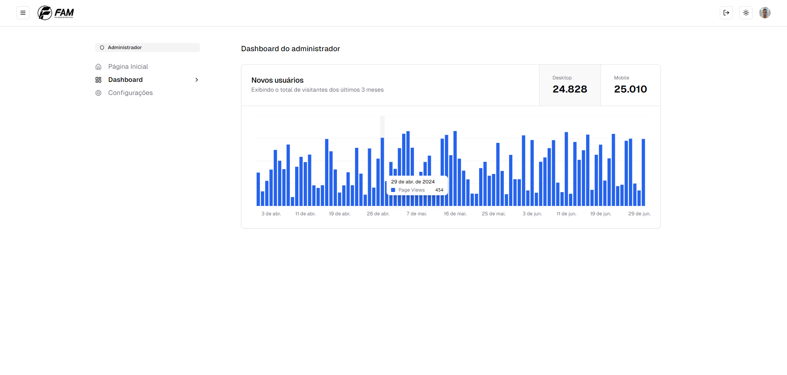
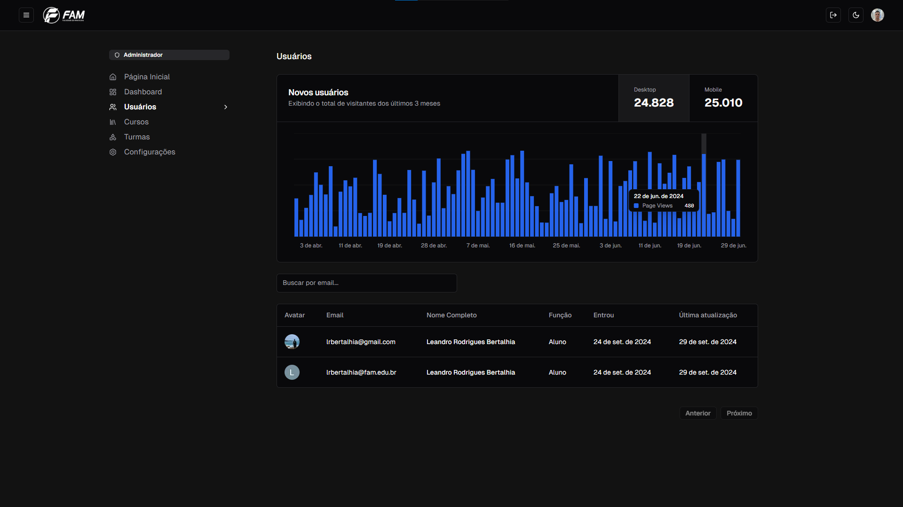
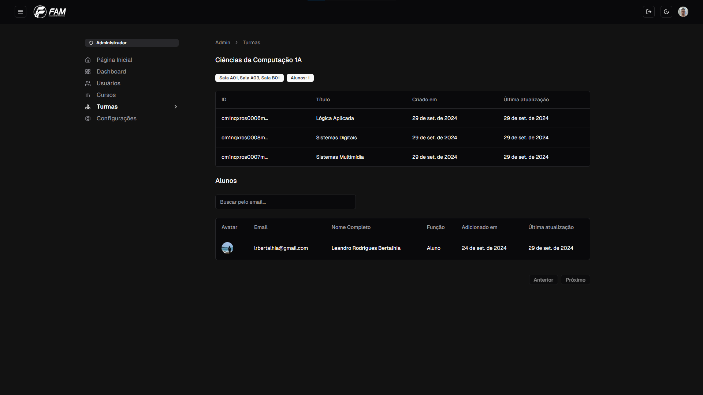

# FAM - Portal Educacional

Este é o repositório do sistema de um portal educacional chamado **FAM** (Faculdade de Americana). O projeto foi desenvolvido para auxiliar na gestão e administração de cursos, turmas, matérias e usuários de forma eficiente e segura.

## 📚 Tecnologias Utilizadas

Este projeto utiliza a seguinte stack:

- **Next.js 14** - Framework React para construção de aplicações web.
- **Typescript** - Superset do JavaScript que adiciona tipagem estática.
- **TailwindCSS** - Biblioteca de CSS utilitária para estilização rápida.
- **Shadcn** - Componentes reutilizáveis e prontos para uso.
- **Prisma ORM** - ORM para integração com banco de dados.
- **Clerk Authentication** - Serviço de autenticação e gestão de usuários.
- **Lucide Icons** - Biblioteca de ícones.
- **Zod** - Biblioteca de validação e tipagem de dados.

## 🎓 Funcionalidades

Atualmente, o sistema conta com as seguintes funcionalidades:

- **Criar usuários** com diferentes cargos.
- **Criar novos cursos, turmas e matérias** para gestão acadêmica.
- **Editar usuários** já cadastrados.
- **Editar matrícula de usuários** para cursos e turmas.
- **Tabelas dinâmicas com pesquisa** para facilitar a visualização de dados.

## 🔒 Segurança

Para garantir a segurança e integridade dos dados, o sistema conta com:

- **Autenticação** por meio do Clerk Authentication.
- **Middleware com Role Based Access Control (RBAC)** para controlar o acesso com base em permissões de cargos.
- **Sincronização de dados** entre o banco de dados e o serviço de autenticação Clerk.

## 📸 Prints do Projeto

Aqui estão alguns prints do sistema para você ter uma ideia de como ele funciona:

### Dashboard de administrador


### Tela de usuários do administrador


### Tela de turmas do administrador


## 🚀 Como executar o projeto

1. Clone este repositório:
   
   ```bash
   git clone https://github.com/leandrordg/fam-portal.git
   ```
2. Instale as dependências **(preferência pnpm)**:
   
   ```bash
   pnpm install
   ```
3. Configure as variáveis de ambiente necessárias no arquivo ```.env```
4. Execute a aplicação:
   ```bash
   pnpm run dev
   ```
5. Acesse o sistema em ```http://localhost:3000```.

## 📄 Licença

Este projeto está sob a licença MIT. Veja o arquivo ```LICENSE``` para mais detalhes.

Desenvolvido com ❤️ por Leandro Rodrigues.
